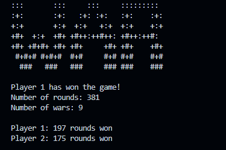

# WAR CARD GAME

Simulation of the card game war that gives stats at the end of the match, made while learning Python.

- All 56 cards are used
- The cards are shuffled only once, at the start of the match
- When war happens, each player withdraws 3 cards

